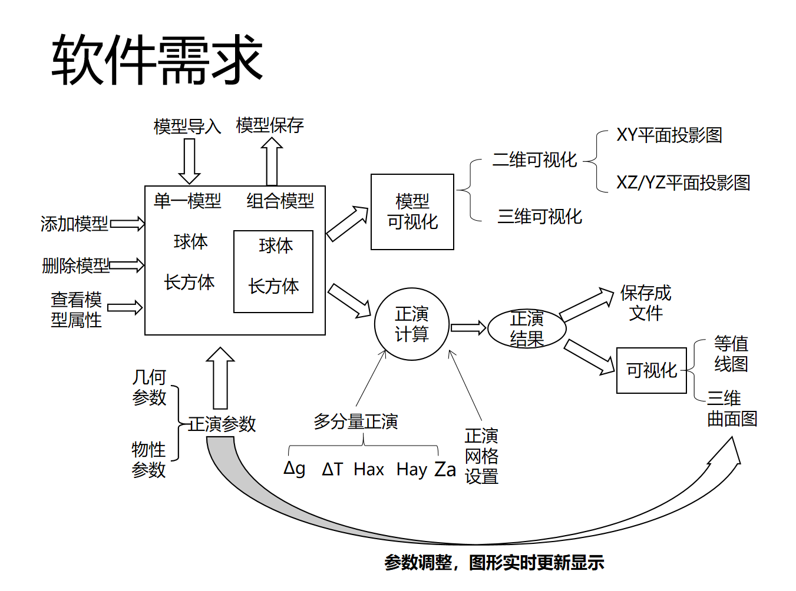
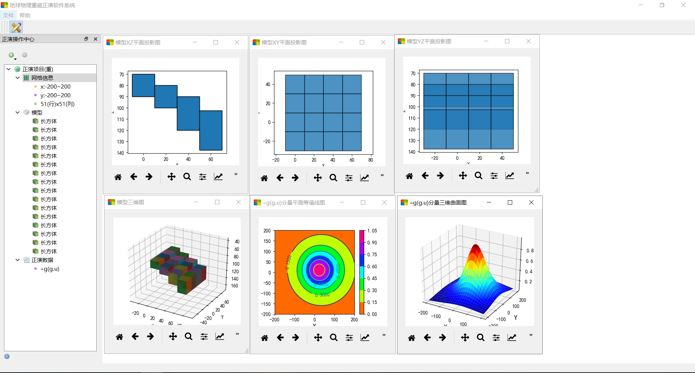
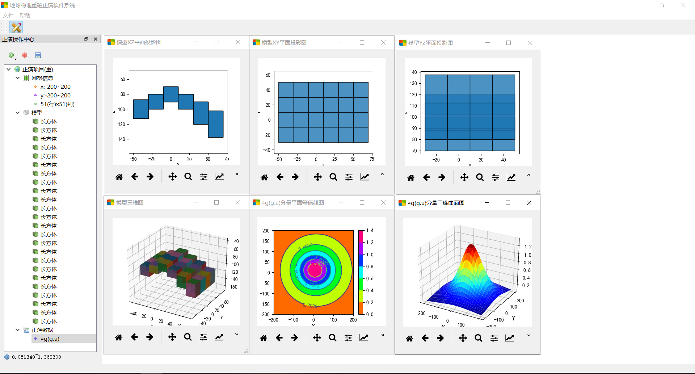
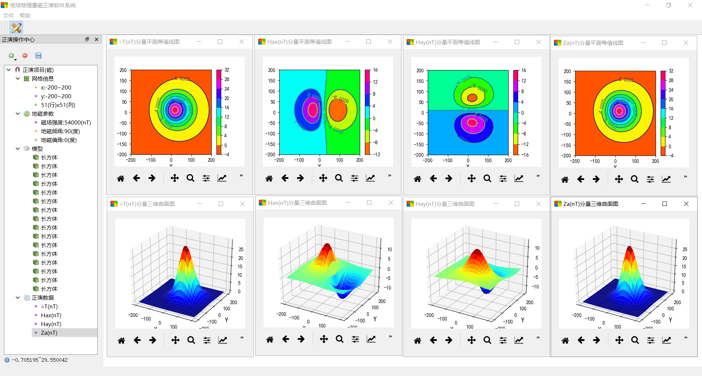
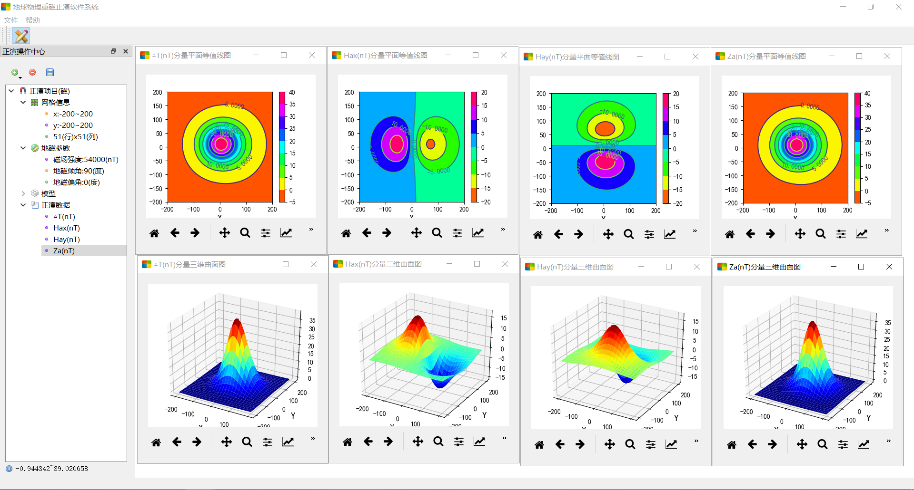

# GMFS

> Gravity and Magnetic Forward Modeling Software  
> 地球物理重磁正演软件系统（PyQt5 桌面应用）

## 项目简介

GMFS 是一个用于教学/实验场景的重力与磁法正演小型软件。  
项目以 Python + PyQt5 构建桌面交互界面，支持在二维网格上建立简单地质体模型（球体、长方体），计算对应的重磁异常，并进行可视化与数据导出。

当前代码形态偏向毕业设计原型，功能完整可用，但工程化程度（测试、打包、参数校验、文档化）仍有提升空间。

## 主要功能

- 新建正演项目
  - 磁法正演项目
  - 重力正演项目
- 设置网格参数
  - x/y 范围
  - 行列数（rows/cols）
- 磁法项目支持设置地磁参数
  - `T0`（地磁场强度）
  - `I0`（地磁倾角）
  - `D0`（地磁偏角）
- 添加理论模型
  - 球体模型
  - 长方体模型
- 计算与管理正演数据
  - 磁法分量：`△T`、`Hax`、`Hay`、`Za`
  - 重力分量：`△g`
- 可视化
  - 模型：XZ/XY/YZ 投影图、模型三维图
  - 正演数据：平面等值线图、三维曲面图
- 文件导入导出
  - 导入/保存模型（文本格式）
  - 保存正演网格数据（`Surfer ASCII Grid`，`.grd`）

## 技术栈与依赖

- Python 3.x
- PyQt5（界面）
- NumPy（数值计算）
- Matplotlib（绘图，可视化）

建议使用虚拟环境安装依赖。

## 项目结构

```text
GMFS/
├─ MainWindow.py                     # 程序入口与主窗口
├─ Ui_MainWindow.py                  # 主窗口 UI 代码（由 .ui 转换）
├─ aboutDlg.py / Ui_aboutDlg.py      # 关于对话框
├─ ForwardCenter/                    # 左侧“正演操作中心”
│  ├─ ForwardCenterWidget.py         # 核心交互逻辑（树、菜单、动作）
│  ├─ ForwardProjectManager.py       # 多项目管理
│  ├─ Ui_ForwardCenterWidget.py      # UI 代码
│  └─ *.qrc / *_rc.py                # 资源
├─ UI/                               # 业务模型与各类对话框/绘图
│  ├─ ForwardProject.py              # 核心计算（重磁正演）
│  ├─ model.py                       # 球体/长方体模型参数
│  ├─ matplotlibWidget.py            # Matplotlib 嵌入 Qt 组件
│  ├─ *Dialog.py                     # 参数设置与结果展示窗口
│  ├─ Ui_*.py                        # 由 .ui 转换生成
│  └─ *.ui / *.qrc / *_rc.py         # Qt Designer 源文件与资源
└─ README.md
```

## 快速开始

### 1) 安装依赖

```bash
pip install pyqt5 numpy matplotlib
```

### 2) 运行程序

在项目根目录执行：

```bash
python MainWindow.py
```

## 使用流程（推荐）

1. 新建项目（磁法或重力）
2. 设置网格参数（范围与分辨率）
3. （磁法项目）设置地磁参数
4. 添加模型（球体/长方体），输入几何与物性参数
5. 添加正演分量（如 `△T` 或 `△g`）
6. 查看等值线图 / 三维曲面图
7. 按需导出模型与正演网格数据

## 软件需求与示例图

### 软件需求



### 示例结果图

#### 重力阶梯模型



#### 重力背斜模型



#### 磁法台阶模型



#### 磁法背斜模型



## 数据与文件格式

### 模型文件（导入/导出，`.txt`）

模型文件为纯文本，按行顺序写入。大致结构：

1. 项目类型（`0` 磁法，`1` 重力）
2. 模型数量
3. 每个模型依次写入：
   - 模型类型（`0` 球体，`1` 长方体）
   - 几何参数（中心、半径或长宽高）
   - 物性参数（磁化率 `K` 或密度 `density`）

### 正演网格数据（导出，`.grd`）

导出为 `Surfer ASCII Grid (DSAA)` 格式，包含：

- 文件头 `DSAA`
- 网格尺寸 `nx ny`
- x 范围 `xmin xmax`
- y 范围 `ymin ymax`
- 数据最小/最大值
- 网格数据矩阵

## 代码说明

- 正演计算核心：`UI/ForwardProject.py`
  - 重力与磁法不同分量的计算在 `calculateForwardData()` 中完成
  - 支持多个模型叠加
  - 模型参数变化后自动触发数据重算与图形刷新
- 交互控制核心：`ForwardCenter/ForwardCenterWidget.py`
  - 管理树节点、右键菜单、参数对话框
  - 负责模型和正演数据的新增/删除/显示/保存

## 已知限制

- 暂无自动化测试与 CI
- 以交互式桌面应用为主，未提供命令行批处理接口
- 物理模型目前仅包含球体与长方体
- 参数输入与异常处理可进一步加强
- 尚未提供正式发布包（如 `exe`）

## 后续可改进方向

- 增加更多几何体与正演分量
- 提供工程文件保存/加载（项目级）
- 增加单元测试与数值结果校验
- 增加打包脚本（`PyInstaller`）与一键发布
- 增加英文文档和示例数据

## 许可证

本项目采用 **MIT License**，详见 `LICENSE`。